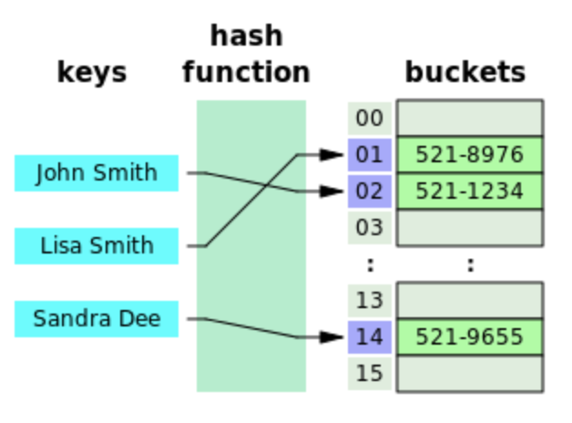
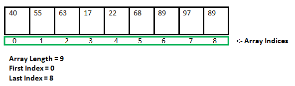
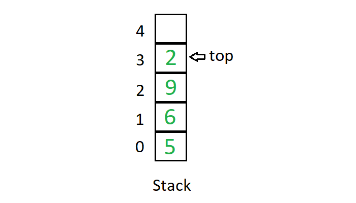

# SACrackingTheCodingInterviewCPPSolutions
C++ Solutions of "Cracking The Coding Interview" questions

## Data structures

### 1a Hash Tables

  

* Definition: A hash table is a data structure that maps keys to values for highly efficient lookup  
* Implementation: As an array of linked lists (for collision handling) + hash code function (`key % buffer_size`) to determine position in array  
* Functionality: `insert()`, `find()`
* Advantage: Quick access, insert and remove O(1)  
* Used in problems:  Word counts, presence check . 

Sources:  
* [Templates](http://www.cplusplus.com/doc/oldtutorial/templates/)  
* [Template based Hashtable solution](https://medium.com/@aozturk/simple-hash-map-hash-table-implementation-in-c-931965904250)  
* [Header guards](http://forums.devshed.com/programming-42/compile-error-redefinition-class-437198.html)  

### 1b Arrays

  

* Definition: A data structure, here with fixed length, and contingous memory allocation  
* Functionality: `[] Operator`, `size()`  
* Advantage: Quick access O(1)  
* Disadvantage: Slow insert, erase and search O(N)
* Used in problems:  

Sources:  
* [Unknown Array Size](https://stackoverflow.com/questions/22432755/how-to-initialize-an-array-whose-size-is-initially-unknown)  
* [Stack vs. Heap](https://stackoverflow.com/questions/5836309/stack-memory-vs-heap-memory)  
* [Array operator[]](https://stackoverflow.com/questions/37043078/c-overloading-array-operator)  

### 2 Linked Lists

  

* Definition: A linear data structure, in which the elements are not stored at contiguous memory locations, but are linked using pointers as shown in the image. Available as Single Linked List that only stores the next node and Double Linked List that stores the previous node too  
* Functionality: `push_back()`, `size()`, `begin()`, `end()`  
* Advantage: Fast insert and delete O(1)  
* Disadvantage: Slow search and access O(N)
* Used in problems:  

Sources:  
* [Inheritance of templated classes](https://blog.feabhas.com/2014/06/template-inheritance/)
* [this->](https://stackoverflow.com/questions/993352/when-should-i-make-explicit-use-of-the-this-pointer)  
* [Multiple forms of templated class](https://stackoverflow.com/questions/19923353/multiple-typename-arguments-in-c-template)

### 3a Stacks

  

### 3b Queues

  

