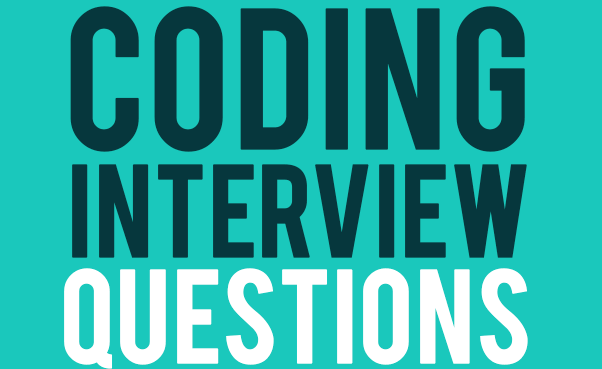

# SACrackingTheCodingInterviewCPPSolutions
C++ Solutions of "Cracking The Coding Interview" questions

## [Data structures](https://github.com/appinho/SACrackingTheCodingInterview/tree/master/data_structures)

  

## [Algorithms](https://github.com/appinho/SACrackingTheCodingInterview/tree/master/algorithms)

  

## [Interview questions](https://github.com/appinho/SACrackingTheCodingInterview/tree/master/interview_questions)

  

